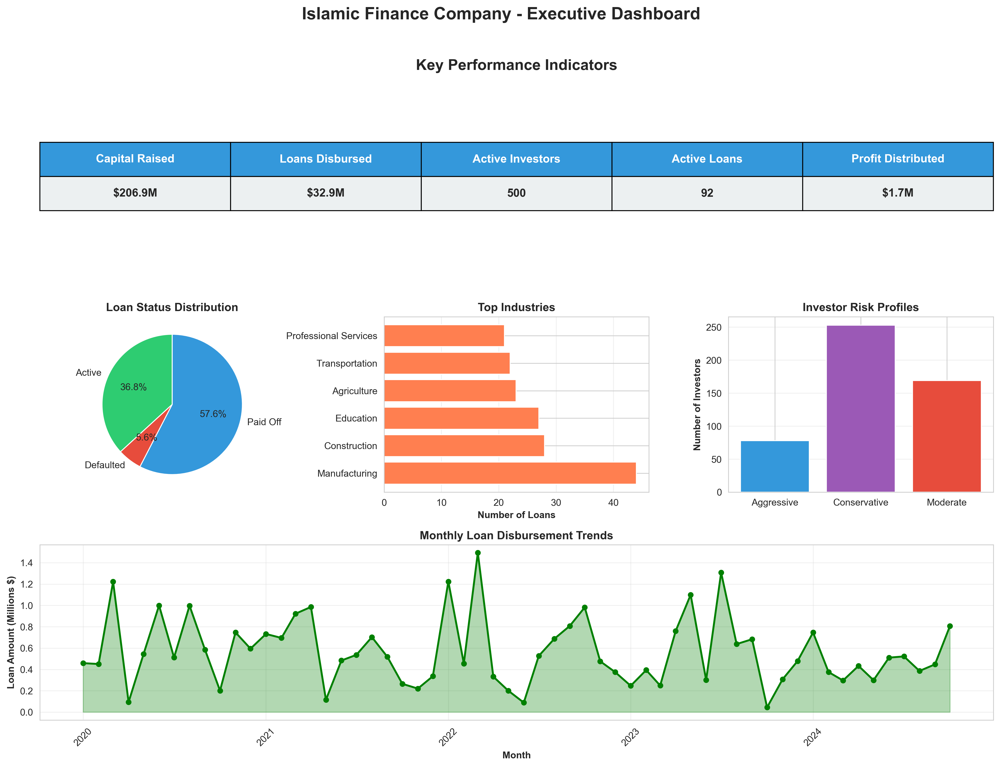
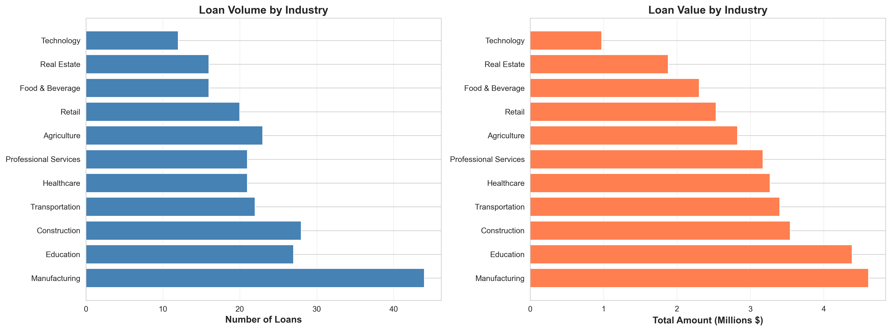
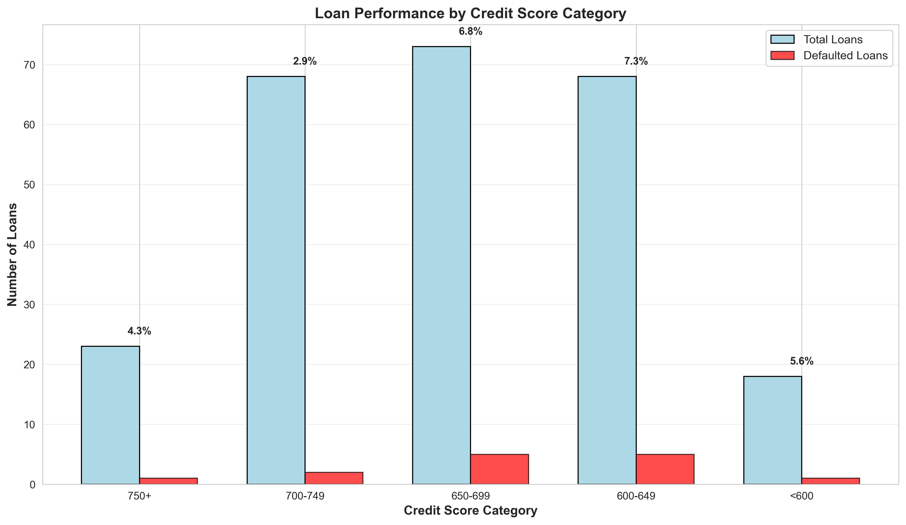
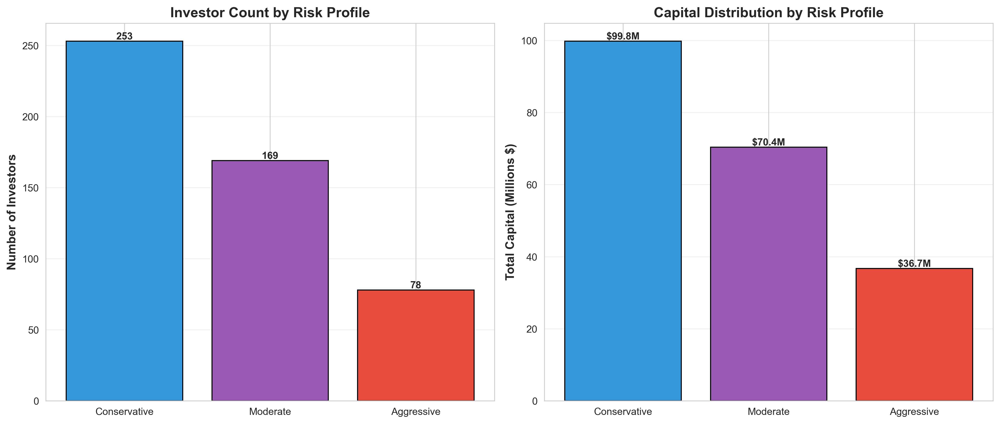
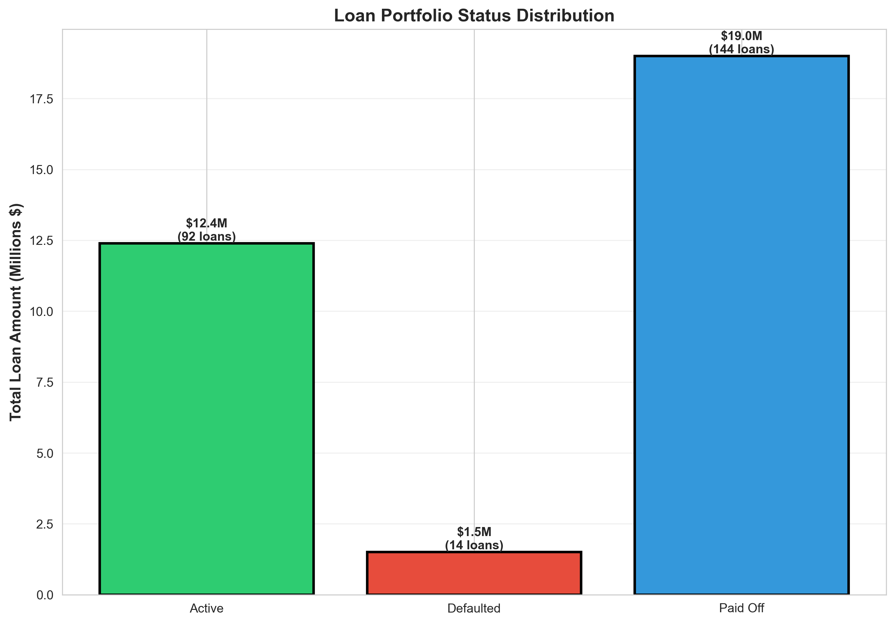
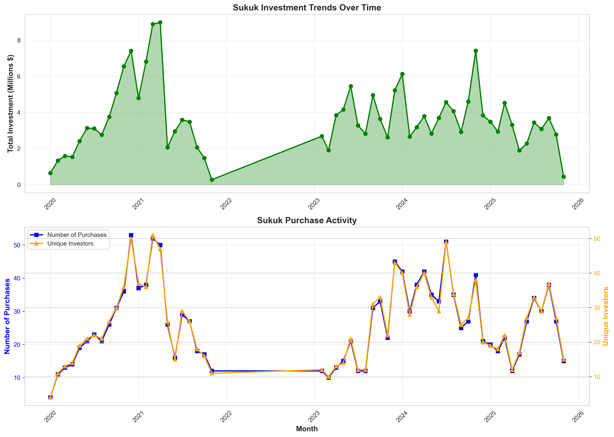
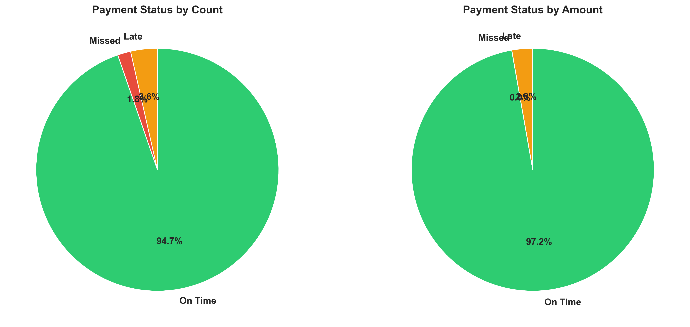
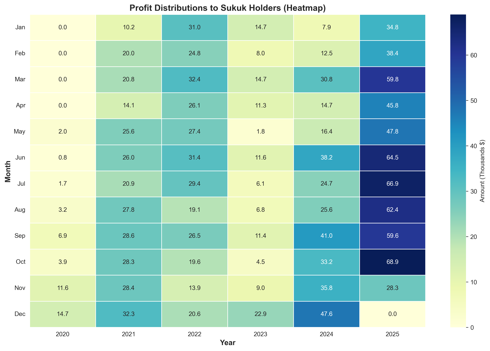

# Islamic Finance Analytics Platform

[](https://www.python.org/)
[](https://www.sqlite.org/)
[](LICENSE)

A comprehensive data science project simulating an Islamic finance company that issues Sukuk (صكوك) to investors and provides Sharia-compliant business financing. This project demonstrates end-to-end skills in database design, data analysis, and visualization.



## 🎯 Project Overview

This platform simulates a complete Islamic finance ecosystem:
- **Sukuk Issuance**: Islamic bonds sold to investors seeking ethical investments
- **Business Financing**: Sharia-compliant loans provided to businesses across 11 industries
- **Profit Distribution**: Returns paid to Sukuk holders based on actual business performance

### Key Metrics from Simulation:
- **$206.9M** Capital raised through Sukuk
- **500** Active investors across 3 risk profiles
- **250** Business loans across 11 industries
- **4,600+** Total records spanning 5 years of operations
- **5.6%** Portfolio default rate
- **94.7%** On-time payment rate

## 📊 Business Insights

### Industry Performance Analysis
Different industries show varying risk profiles. Construction and Technology demonstrate the lowest default rates, while Agriculture shows higher risk.



### Default Rate by Credit Score
Credit scores effectively predict loan performance, validating our risk assessment model.



### Investor Segmentation
Conservative investors (50.6%) form the largest segment, reflecting the risk-averse nature of Islamic finance participants.



### Portfolio Status
The majority of loans are either actively performing or successfully paid off, with defaults maintained at manageable levels.



## 🗂️ Database Schema

The project uses an 8-table relational database with proper normalization:

### Core Entities
- **`employees`** - Company staff across 7 departments (50 records)
- **`investors`** - Sukuk purchasers with risk profiles (500 records)
- **`borrowers`** - Businesses seeking financing (300 records)

### Financial Instruments
- **`sukuk_issuances`** - Islamic bond products (10 products)
- **`sukuk_purchases`** - Investor transactions (1,500 records)
- **`business_loans`** - Financing provided (250 records)
- **`loan_payments`** - Payment history (2,000 records)
- **`profit_distributions`** - Returns to investors (800 records)

### Schema Diagram
```
investors ─────┐
               ├──→ sukuk_purchases ──→ profit_distributions
sukuk_issuances┘

borrowers ─────→ business_loans ──→ loan_payments

employees ─────→ (approvals/processing)
```

## 🚀 Getting Started

### Prerequisites
```bash
Python 3.8+
pip package manager
```

### Installation

1. **Clone the repository**
```bash
git clone https://github.com/M-AlAteegi/islamic-finance-analytics.git
cd islamic-finance-analytics
```

2. **Install dependencies**
```bash
pip install -r requirements.txt
```

### Usage

#### Step 1: Generate the Database
```bash
python islamic_finance_db.py
```
Creates `islamic_finance_company.db` with realistic data (~30-60 seconds)

#### Step 2: Run Analytics
```bash
python analytics_script.py
```
Performs 10 comprehensive analyses and displays results in terminal

#### Step 3: Generate Visualizations
```bash
python visualizations.py
```
Creates 8 professional charts saved as PNG files

## 📈 Analytics Performed

The platform includes 10 comprehensive business analyses:

1. **Portfolio Overview** - High-level financial snapshot and KPIs
2. **Industry Performance** - Loan performance segmented by business sector
3. **Credit Score Analysis** - Correlation between credit scores and defaults
4. **Investor Analysis** - Customer segmentation and behavior patterns
5. **Time-Series Trends** - Historical patterns and growth trajectories
6. **Payment Behavior** - Collection effectiveness and delinquency rates
7. **Profitability Analysis** - Revenue generation and profit margins
8. **Employee Productivity** - Operational efficiency metrics
9. **Risk Metrics** - Portfolio health indicators and concentration risk
10. **Cohort Analysis** - Performance tracking by loan vintage year

### Sample Analysis Output

```
📊 Financial Snapshot:
────────────────────────────────────────────────────────────
Capital Raised (Sukuk Sales):        $206,873,727.00
Total Loans Disbursed:               $32,897,420.00
Current Outstanding Balance:         $6,366,952.48
Default Rate (by count):             5.60%
Payment On-Time Rate:                94.70%
Return on Active Assets:             10.31%
────────────────────────────────────────────────────────────
```

## 🎨 Visualizations

### Sukuk Performance Trends
Tracking investment activity and capital flows over time.



### Payment Behavior Distribution
Analysis of borrower payment patterns showing strong collection performance.



### Profit Distribution Heatmap
Quarterly profit distributions to Sukuk holders visualized over time.



## 💼 Skills Demonstrated

### Technical Skills
- **SQL**: Complex queries, joins, aggregations, subqueries, CTEs
- **Python**: Pandas, NumPy, data manipulation, OOP principles
- **Database Design**: Normalization, foreign keys, referential integrity
- **Data Visualization**: Matplotlib, Seaborn, multi-panel dashboards
- **Data Generation**: Realistic simulation using Faker library

### Business Skills
- **Financial Analysis**: ROI, default rates, capital utilization
- **Risk Assessment**: Credit scoring, portfolio concentration analysis
- **Customer Analytics**: Segmentation, behavioral analysis, lifetime value
- **Domain Knowledge**: Islamic finance principles (Sukuk, profit-sharing, Sharia compliance)

### Analytical Techniques
- Cohort analysis
- Time-series analysis
- Statistical distributions
- Correlation analysis
- Portfolio risk metrics

## 📚 Islamic Finance Principles

This project adheres to Sharia-compliant financial practices:

### Core Principles
- **No Riba (Interest)**: Profits are shared, not charged as fixed interest
- **Asset-Backed**: All Sukuk represent ownership in tangible assets
- **Risk Sharing**: Investors share in actual business performance
- **Ethical Investment**: Financing aligned with Islamic values

### Sukuk Types Simulated
- **Ijara** - Lease-based financing
- **Mudaraba** - Profit-sharing partnership
- **Musharaka** - Joint venture partnership
- **Murabaha** - Cost-plus financing
- **Istisna** - Manufacturing/construction financing

## 📁 Project Structure

```
islamic-finance-analytics/
│
├── README.md                      # Project documentation
├── requirements.txt               # Python dependencies
├── .gitignore                     # Git ignore rules
│
├── islamic_finance_db.py          # Database generator (600+ lines)
├── analytics_script.py            # Business analytics (400+ lines)
├── visualizations.py              # Chart generation (400+ lines)
│
├── islamic_finance_company.db     # SQLite database (generated)
│
└── visualizations/                # Generated charts
    ├── viz_loan_by_industry.png
    ├── viz_default_analysis.png
    ├── viz_sukuk_performance.png
    ├── viz_payment_status.png
    ├── viz_investor_profiles.png
    ├── viz_loan_status.png
    ├── viz_profit_heatmap.png
    └── viz_dashboard.png
```

## 🔍 Sample SQL Queries

### Default Rate by Industry
```sql
SELECT 
    b.industry,
    COUNT(*) as total_loans,
    SUM(CASE WHEN bl.loan_status = 'Defaulted' THEN 1 ELSE 0 END) as defaults,
    ROUND(100.0 * SUM(CASE WHEN bl.loan_status = 'Defaulted' THEN 1 ELSE 0 END) / 
          COUNT(*), 2) as default_rate_pct
FROM business_loans bl
JOIN borrowers b ON bl.borrower_id = b.borrower_id
GROUP BY b.industry
ORDER BY default_rate_pct DESC;
```

### Top Performing Investors
```sql
SELECT 
    i.first_name || ' ' || i.last_name as investor_name,
    i.total_invested,
    SUM(pd.amount) as total_returns,
    ROUND(100.0 * SUM(pd.amount) / i.total_invested, 2) as roi_pct
FROM investors i
LEFT JOIN sukuk_purchases sp ON i.investor_id = sp.investor_id
LEFT JOIN profit_distributions pd ON sp.purchase_id = pd.purchase_id
GROUP BY i.investor_id
ORDER BY total_returns DESC;
```

## 🎓 Key Findings

### Risk Insights
- **Credit Score Correlation**: Higher credit scores (750+) show 4.35% default rate vs 5.56% for scores below 600
- **Industry Risk**: Construction (0% defaults) vs Agriculture (17.4% defaults)
- **Portfolio Concentration**: Well-diversified across 11 industries, largest exposure 14.03%

### Operational Insights
- **Payment Performance**: 94.7% on-time payment rate indicates strong underwriting
- **Capital Efficiency**: 15.9% utilization suggests conservative lending or capital surplus
- **Vintage Performance**: 2020 vintage shows 90.38% payoff rate demonstrating loan maturity

### Customer Insights
- **Investor Profile**: 50.6% conservative, 33.8% moderate, 15.6% aggressive
- **Average Investment**: Conservative investors average $535K per investor
- **Loyalty**: Top 10 investors contribute significant portfolio concentration

## 🔮 Future Enhancements

Potential additions to expand the project:

### Machine Learning Models
- Default prediction using borrower characteristics
- Customer lifetime value prediction
- Credit score optimization algorithm
- Churn prediction for investors

### Interactive Dashboard
- Streamlit or Dash web application
- Real-time filtering and drill-down capabilities
- Interactive visualizations
- User authentication

### Advanced Analytics
- Monte Carlo simulations for stress testing
- Scenario analysis for economic downturns
- Portfolio optimization recommendations
- Predictive cash flow modeling

### API Development
- RESTful API using Flask or FastAPI
- CRUD operations for all entities
- Authentication and authorization
- Rate limiting and caching

## 📝 License

This project is licensed under the MIT License - see the [LICENSE](LICENSE) file for details.

## 👤 Author

**Mohammed Al-Ateegi**
- GitHub: [@M-AlAteegi](https://github.com/M-AlAteegi)
- LinkedIn: [Mohammed Al-Ateegi]([https://www.linkedin.com/in/mohammed-al-ateegi](https://www.linkedin.com/in/mohammed-alateegi-2853b3248/)

## 🤝 Contributing

Contributions, issues, and feature requests are welcome! Feel free to check the [issues page](https://github.com/M-AlAteegi/islamic-finance-analytics/issues).

## ⭐ Show Your Support

Give a ⭐ if this project helped you learn about data science, databases, or Islamic finance!

---

**Note**: All data in this project is synthetically generated for educational purposes and does not represent real individuals, companies, or financial transactions.

## 📧 Contact

For questions or collaboration opportunities, please reach out through GitHub or LinkedIn.

---

*Built with Python, SQL, and a passion for data-driven insights* 🚀
